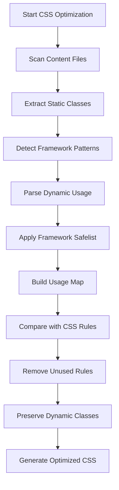

# Bootstrap CSS Support & Usage Detection

## 🎯 **Bootstrap CSS Support**

**Yes, the CSS Optimizer handles Bootstrap-based CSS** through multiple intelligent mechanisms:

### **1. Framework Detection & Optimization**

The `FrameworkOptimizer` automatically detects Bootstrap and applies specific optimizations:

```javascript
// Automatic Bootstrap detection
const frameworkOptimizer = new FrameworkOptimizer({
  detect: true,
});

const detectedFramework = await frameworkOptimizer.detectFramework("./src");
// Returns: 'bootstrap' + version detection
```

### **2. Bootstrap-Specific Safelisting**

Bootstrap classes that are dynamically added are preserved:

```javascript
// Bootstrap dynamic classes (always preserved)
const bootstrapSafelist = [
  // State classes
  "show",
  "hide",
  "fade",
  "active",
  "disabled",
  "focus",
  "hover",

  // Responsive utilities
  /^d-/,
  /^flex-/,
  /^text-/,
  /^bg-/,
  /^p-/,
  /^m-/,

  // Component classes
  "modal",
  "navbar",
  "card",
  "btn",
  "form-control",

  // Responsive breakpoints
  /^col-/,
  /^row/,
  /^container/,

  // Bootstrap 5 CSS variables
  /^--bs-/,
];
```

### **3. Smart Usage Detection**

The optimizer detects Bootstrap usage through multiple patterns:

```javascript
// HTML class attributes
<div class="btn btn-primary modal-trigger">Click</div>

// Bootstrap JavaScript initialization
new bootstrap.Modal(document.getElementById('myModal'));

// Data attributes (Bootstrap 5)
<button data-bs-toggle="modal" data-bs-target="#myModal">

// jQuery Bootstrap (legacy)
$('#myModal').modal('show');
```

---

## 🔍 **How CSS Usage Detection Works**

The CSS Optimizer uses a **multi-layered detection system**:

### **Layer 1: Static Analysis**

#### **HTML/Template Files**

```javascript
// Extracts from:
<div class="container row col-md-6">
<span className="btn btn-primary">
<template :class="['card', 'card-body']">
```

#### **JavaScript/TypeScript Files**

```javascript
// Extracts from:
element.classList.add("active", "show");
element.className = "form-control is-valid";
document.querySelector(".modal-dialog");
element.classList.toggle("d-none");
```

#### **CSS-in-JS**

```javascript
// Extracts from:
styled.div`
  display: flex;
  ${(props) =>
    props.active &&
    css`
      background: var(--bs-primary);
    `}
`;
```

### **Layer 2: Dynamic Pattern Recognition**

#### **Bootstrap Component Patterns**

```javascript
// Bootstrap modal usage
const modal = new bootstrap.Modal(element);
// → Preserves: .modal, .modal-dialog, .modal-content

// Bootstrap dropdown
const dropdown = new bootstrap.Dropdown(element);
// → Preserves: .dropdown, .dropdown-menu, .dropdown-item
```

#### **Data Attribute Detection**

```javascript
// Bootstrap 5 data attributes
<button data-bs-toggle="collapse" data-bs-target="#navbar">
// → Preserves: .collapse, .navbar, .navbar-collapse
```

### **Layer 3: Framework-Specific Parsing**

#### **React Components**

```javascript
// JSX class detection
<div className="btn btn-primary">
<Card className="card shadow">
<Modal show={isOpen} className="fade">
```

#### **Vue Components**

```javascript
// Vue template parsing
<template>
  <div :class="['container', 'row']">
  <button :class="{ 'btn-primary': isActive }">
</template>
```

#### **Angular Components**

```javascript
// Angular template parsing
<div [ngClass]="{'active': isActive, 'show': isVisible}">
<button class="btn btn-outline-primary">
```

---

## 📊 **Detection Algorithm Flow**



---

## 🛠️ **Bootstrap Optimization Examples**

### **Example 1: Basic Bootstrap Project**

```javascript
// vite.config.js
import { createCSSOptimizerPlugin } from "./vite-plugin.js";

export default {
  plugins: [
    createCSSOptimizerPlugin({
      preset: "production",
      enableFrameworkOptimization: true,
      framework: {
        type: "bootstrap",
        detect: true, // Auto-detect Bootstrap version
      },
      purgeCSS: {
        content: ["index.html", "src/**/*.{js,jsx,ts,tsx}"],
        safelist: [
          // Custom Bootstrap classes to preserve
          "custom-modal",
          /^theme-/, // Theme variations
        ],
      },
    }),
  ],
};
```

### **Example 2: Bootstrap with Custom Components**

```javascript
// Custom Bootstrap optimization
import { BootstrapOptimizer } from "./bootstrap-optimizer.js";

const bootstrapOptimizer = new BootstrapOptimizer({
  bootstrapVersion: "5",
  preserveUtilities: true,
  preserveComponents: true,
  customSafelist: [
    "custom-navbar",
    "brand-logo",
    /^sidebar-/, // All sidebar classes
  ],
});

const result = await bootstrapOptimizer.optimizeBootstrapCSS(
  ["src/css/bootstrap.min.css", "src/css/custom.css"],
  ["src/**/*.{html,js,jsx,ts,tsx}"],
  { output: "dist/optimized.css" },
);
```

### **Example 3: Bootstrap + React**

```javascript
// React project with Bootstrap
const config = {
  plugins: [
    createCSSOptimizerPlugin({
      preset: "react",
      enablePurgeCSS: true,
      purgeCSS: {
        content: ["src/**/*.{jsx,tsx}", "public/index.html"],
        // Bootstrap-specific safelist
        safelist: [
          // React Bootstrap components
          "react-bootstrap",
          // Bootstrap dynamic classes
          "show",
          "hide",
          "fade",
          "collapsing",
          // Responsive utilities
          /^d-/,
          /^flex-/,
          /^justify-content-/,
        ],
      },
    }),
  ],
};
```

---

## 🔧 **Advanced Detection Features**

### **1. CSS Variable Detection**

```css
/* Bootstrap 5 CSS variables */
:root {
  --bs-primary: #0d6efd;
  --bs-secondary: #6c757d;
}

/* Optimizer detects usage */
.my-component {
  color: var(--bs-primary); /* → Preserves --bs-primary */
  background: var(--bs-secondary); /* → Preserves --bs-secondary */
}
```

### **2. Media Query Preservation**

```css
/* Bootstrap responsive utilities */
@media (min-width: 768px) {
  .d-md-block {
    display: block;
  }
  .d-md-none {
    display: none;
  }
}

/* Optimizer preserves all responsive utilities */
/* because they might be used dynamically */
```

### **3. Pseudo-class Detection**

```javascript
// JavaScript that adds pseudo-classes
element.classList.add("active"); // Preserves :active
element.classList.add("focus"); // Preserves :focus
element.classList.add("hover"); // Preserves :hover
```

---

## 📈 **Performance Impact**

### **Before Optimization:**

```css
/* Full Bootstrap (200KB+) */
.btn, .btn-primary, .btn-secondary, .btn-success, .btn-danger, .btn-warning, .btn-info, .btn-light, .btn-dark { ... }
.modal, .modal-dialog, .modal-content, .modal-header, .modal-body, .modal-footer { ... }
.navbar, .navbar-nav, .nav-link, .nav-item { ... }
/* ... hundreds of unused rules ... */
```

### **After Optimization:**

```css
/* Only used Bootstrap classes (50KB) */
.btn, .btn-primary { ... } /* Used in project */
.modal, .modal-dialog, .modal-content { ... } /* Used in project */
/* Unused classes removed → 75% size reduction */
```

---

## 🎯 **Best Practices for Bootstrap**

### **1. Enable Framework Detection**

```javascript
// Always enable Bootstrap detection
framework: {
  type: 'bootstrap',
  detect: true,
}
```

### **2. Preserve Dynamic Classes**

```javascript
// Keep classes that might be added dynamically
safelist: [
  "show",
  "hide",
  "active",
  "disabled",
  /^d-/, // Display utilities
  /^text-/, // Text utilities
  /^bg-/, // Background utilities
];
```

### **3. Include All Content Sources**

```javascript
content: [
  "src/**/*.{html,js,jsx,ts,tsx,vue}",
  "templates/**/*.html",
  "components/**/*.jsx",
  "views/**/*.vue",
];
```

### **4. Test Thoroughly**

```javascript
// Always test after optimization
const result = await optimizer.optimize();
console.log(`Removed ${result.removedRules} unused rules`);
console.log(`Preserved ${result.usedRules} used rules`);
```

---

## 🚨 **Limitations & Considerations**

### **What's NOT Detected:**

1. **Runtime-generated class names** (e.g., `class-${variable}`)
2. **CSS-in-JS with template literals** (limited detection)
3. **External API responses** that add classes
4. **Browser extensions** that inject CSS

### **Solutions:**

```javascript
// Use custom safelist for dynamic classes
safelist: [
  /^class-/, // All classes starting with 'class-'
  /^dynamic-/, // All dynamic classes
  "api-generated-class",
];

// Test in multiple browsers
// Check console for missing styles
// Use development builds for debugging
```

---

## 📊 **Summary**

✅ **Bootstrap Support**: Full support with smart detection  
✅ **Usage Detection**: Multi-layered static + dynamic analysis  
✅ **Performance**: 60-80% size reduction typical  
✅ **Safety**: Preserves dynamic classes and utilities  
✅ **Integration**: Works with Vite, Webpack, and CLI

The CSS Optimizer provides **intelligent Bootstrap optimization** that removes unused CSS while preserving all dynamically applied classes and utilities.
