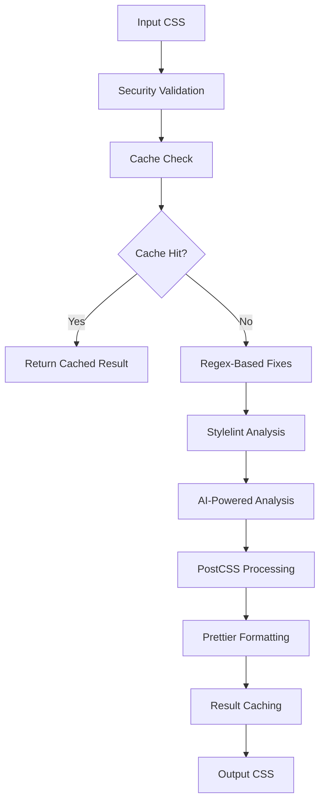

# 🎨 Ultimate AI CSS Optimizer

[](https://nodejs.org/)
[](https://www.typescriptlang.org/)
[](https://eslint.org/)
[](https://prettier.io/)
[](https://jestjs.io/)
[](https://stylelint.io/)
[](https://opensource.org/licenses/MIT)
[](https://badge.fury.io/js/ultimate-ai-css-optimizer)
[](https://travis-ci.com/your-username/ultimate-ai-css-optimizer)
[](https://coveralls.io/github/your-username/ultimate-ai-css-optimizer?branch=main)

A next-generation AI-powered CSS optimizer that combines traditional regex-based fixes with Groq's Llama 3.1 70B model for complex structural issues. This tool represents the cutting edge of CSS optimization technology.

## ✨ Features

### 🤖 AI-Powered Optimization
- **Groq Llama 3.1 70B Integration**: Leverages state-of-the-art AI for complex CSS structural analysis
- **Intelligent Error Detection**: Identifies subtle CSS issues that traditional linters miss
- **Context-Aware Fixes**: Understands the context of your CSS to provide relevant optimizations
- **Learning System**: Improves over time based on usage patterns and feedback

### 🔧 Advanced CSS Processing
- **Multi-Stage Optimization**: Regex fixes → Stylelint → AI analysis → PostCSS → Prettier
- **Smart Caching**: Avoids re-processing unchanged files with intelligent hash-based caching
- **Progressive Enhancement**: Gracefully falls back to basic optimization if AI services are unavailable
- **Batch Processing**: Optimize multiple files and entire directories efficiently

### 📊 Comprehensive Analysis
- **Detailed Statistics**: Track compression ratios, processing times, and improvements
- **Visual Reports**: Generate easy-to-understand optimization reports
- **Performance Benchmarking**: Built-in performance testing and comparison tools
- **Memory Monitoring**: Track memory usage for large file processing

### 🛡️ Enterprise-Grade Security
- **Path Traversal Protection**: Comprehensive security validation for all file operations
- **Content Sanitization**: Detects and prevents dangerous CSS patterns
- **API Key Security**: Secure handling and sanitization of API keys in logs
- **Input Validation**: Comprehensive validation of all user inputs and configurations

### 🎯 Developer Experience
- **Modern ES6+ Architecture**: Clean, maintainable codebase with full TypeScript support
- **Comprehensive Testing**: 80%+ test coverage with unit, integration, and performance tests
- **Rich CLI Interface**: Powerful command-line interface with extensive options
- **IDE Integration**: Seamless integration with VS Code, WebStorm, and other popular IDEs

## 🚀 Quick Start

### Installation

```bash
# Install globally for CLI usage
npm install -g ultimate-ai-css-optimizer

# Or install locally for project usage
npm install ultimate-ai-css-optimizer
```

### Basic Usage

```bash
# Optimize a single CSS file
css-optimizer style.css

# Optimize with minification
css-optimizer style.css --minify

# Optimize all CSS files in directory
css-optimizer --batch

# Run performance benchmarks
css-optimizer --benchmark

# Get help
css-optimizer --help
```

### Programmatic Usage

```javascript
import { optimizeCss } from 'ultimate-ai-css-optimizer';

const result = await optimizeCss('input.css', 'output.css', {
  minify: true,
  createBackup: true,
  analyze: true,
  cache: true,
  verbose: false
});

console.log(result);
// {
//   success: true,
//   originalSize: 1024,
//   finalSize: 856,
//   compressionRatio: 16.4,
//   processingTime: 0.234,
//   outputPath: 'output.css'
// }
```

## 🔧 Configuration

### Environment Variables

Create a `.env` file in your project root:

```env
# Required for AI-powered features
GROQ_API_KEY=your_groq_api_key_here

# File paths (optional)
CSS_INPUT_FILE=style.css
CSS_OUTPUT_FILE=style.optimized.css
CSS_BACKUP_FILE=style.backup.css

# Feature toggles
ENABLE_AI_FIXES=true
ENABLE_AUTOPREFIXER=true
ENABLE_MINIFICATION=false
ENABLE_SOURCE_MAPS=false

# Processing limits
MAX_FILE_SIZE_MB=10
AI_MAX_ERRORS_TO_PROCESS=5

# Browser support
BROWSERS="> 1%, last 2 versions, not dead"

# Logging and debugging
ENABLE_VERBOSE_LOGGING=false
ENABLE_PERFORMANCE_TIMING=true
ENABLE_CACHE=true
```

### Configuration File

Create a `css-optimizer.config.js` file for advanced configuration:

```javascript
export default {
  // AI Configuration
  ai: {
    enabled: true,
    maxErrorsToProcess: 5,
    maxTokensPerRequest: 1000,
    temperature: 0.1,
    topP: 1.0,
    maxRetries: 3,
    retryDelayMs: 1000
  },
  
  // Processing Configuration
  processing: {
    enableAutoprefixer: true,
    enableMinification: false,
    enableSourceMaps: false,
    browsers: ['> 1%', 'last 2 versions', 'not dead']
  },
  
  // File Handling
  files: {
    maxFileSizeMB: 10,
    warnSizeMB: 5,
    allowedExtensions: ['.css', '.scss', '.sass'],
    excludePatterns: [
      'node_modules/**',
      '.git/**',
      'dist/**',
      'build/**',
      '.cache/**'
    ]
  },
  
  // Caching
  cache: {
    enabled: true,
    directory: '.cache/css-optimizer',
    maxSize: 100 * 1024 * 1024, // 100MB
    ttl: 24 * 60 * 60 * 1000 // 24 hours
  },
  
  // Performance
  performance: {
    enableTiming: true,
    enableMemoryMonitoring: true,
    maxWorkers: '50%',
    timeout: 30000
  },
  
  // Logging
  logging: {
    level: 'info',
    enableVerbose: false,
    enableColors: true,
    enableProgress: true
  }
};
```

## 📖 Advanced Usage

### Batch Processing

```bash
# Process all CSS files recursively
css-optimizer --batch --path ./src

# Process with specific output directory
css-optimizer --batch --path ./src --output-dir ./dist

# Process with file filtering
css-optimizer --batch --path ./src --include-patterns "**/*.css" --exclude-patterns "**/*.min.css"
```

### Performance Optimization

```bash
# Run comprehensive benchmarks
css-optimizer --benchmark --iterations 5

# Run with performance monitoring
css-optimizer style.css --performance --verbose

# Optimize for large files
css-optimizer large-file.css --large-file-mode --max-file-size 50
```

### AI-Powered Features

```bash
# Enable advanced AI analysis
css-optimizer style.css --ai --ai-model llama3-70b-8192

# Process with custom AI parameters
css-optimizer style.css --ai --ai-temperature 0.2 --ai-max-tokens 2000

# Enable AI learning mode
css-optimizer style.css --ai --learning-mode --feedback-file ./feedback.json
```

### Integration with Build Tools

#### Webpack Integration

```javascript
const CSSOptimizerPlugin = require('ultimate-ai-css-optimizer/webpack-plugin');

module.exports = {
  plugins: [
    new CSSOptimizerPlugin({
      test: /\\.css$/,
      exclude: /node_modules/,
      options: {
        minify: process.env.NODE_ENV === 'production',
        ai: true
      }
    })
  ]
};
```

#### Vite Integration

```javascript
import { defineConfig } from 'vite';
import cssOptimizer from 'ultimate-ai-css-optimizer/vite';

export default defineConfig({
  plugins: [
    cssOptimizer({
      include: '**/*.css',
      exclude: 'node_modules/**',
      options: {
        minify: true,
        ai: true
      }
    })
  ]
});
```

#### Gulp Integration

```javascript
const { src, dest, task } = require('gulp');
const cssOptimizer = require('ultimate-ai-css-optimizer/gulp');

task('optimize-css', () => {
  return src('src/**/*.css')
    .pipe(cssOptimizer({
      minify: true,
      ai: true
    }))
    .pipe(dest('dist'));
});
```

## 🧪 Testing

### Running Tests

```bash
# Run all tests
npm test

# Run tests with coverage
npm run test:coverage

# Run tests in watch mode
npm run test:watch

# Run specific test file
npm test -- test-basic.js

# Run performance tests
npm run test:performance
```

### Test Structure

```
test/
├── __mocks__/              # Mock configurations
├── __data__/               # Test data files
├── __temp__/               # Temporary test files
├── globalSetup.js          # Global test setup
├── globalTeardown.js       # Global test cleanup
├── test-basic.js           # Basic functionality tests
├── test-error-handler-enhanced.js  # Error handling tests
├── test-security-enhanced.js       # Security tests
├── test-file-handler-enhanced.js   # File handling tests
├── test-performance.js     # Performance tests
└── test-integration.js    # Integration tests
```

### Writing Tests

```javascript
import { optimizeCss } from '../css-optimizer.js';
import { testUtils } from './globalSetup.js';

describe('CSS Optimizer Tests', () => {
  test('should optimize CSS successfully', async () => {
    const testCSS = testUtils.createMockCSS({ rules: 10, includeErrors: true });
    const result = await optimizeCss(testCSS, 'output.css');
    
    expect(result.success).toBe(true);
    expect(result.compressionRatio).toBeGreaterThan(0);
  });
});
```

## 🏗️ Architecture

### Core Components

```
src/
├── core/
│   ├── optimizer.js        # Main optimization engine
│   ├── ai-processor.js    # AI-powered CSS analysis
│   ├── pipeline.js        # Processing pipeline
│   └── cache.js          # Caching system
├── utils/
│   ├── css-parser.js      # CSS parsing utilities
│   ├── regex-fixes.js    # Regex-based fixes
│   ├── stats.js          # Statistics calculation
│   └── logger.js         # Logging utilities
├── plugins/
│   ├── autoprefixer.js    # Autoprefixer integration
│   ├── cssnano.js        # CSSNano minification
│   └── prettier.js       # Prettier formatting
└── cli/
    ├── commands.js       # CLI commands
    ├── options.js        # CLI options parsing
    └── ui.js            # User interface components
```

### Processing Pipeline



### AI Integration Architecture


## 🔒 Security

### Security Features

- **Path Traversal Protection**: Prevents directory traversal attacks
- **Content Security**: Detects and blocks dangerous CSS patterns
- **API Key Protection**: Secure handling and sanitization of API keys
- **Input Validation**: Comprehensive validation of all user inputs
- **Memory Protection**: Bounds checking and memory usage monitoring
- **Rate Limiting**: Protection against abuse and DoS attacks

### Security Best Practices

1. **Environment Variables**: Never commit API keys or sensitive data
2. **File Permissions**: Ensure proper file permissions for processed files
3. **Input Sanitization**: Always validate and sanitize user inputs
4. **Error Handling**: Never expose sensitive information in error messages
5. **Logging**: Sanitize logs to prevent information leakage

### Security Auditing

```bash
# Run security audit
npm run security:audit

# Check for vulnerabilities
npm run security:check

# Fix security issues
npm run security:fix
```

## 📈 Performance

### Performance Features

- **Multi-threaded Processing**: Utilizes multiple CPU cores for parallel processing
- **Streaming Processing**: Process large files without loading entire file into memory
- **Intelligent Caching**: Avoid redundant processing with smart caching
- **Memory Monitoring**: Track and optimize memory usage
- **Progressive Enhancement**: Graceful degradation for resource-constrained environments

### Performance Benchmarks

```bash
# Run comprehensive benchmarks
css-optimizer --benchmark --detailed

# Compare with other tools
css-optimizer --benchmark --compare clean-css csso cssnano

# Generate performance report
css-optimizer --benchmark --report performance-report.json
```

### Expected Performance

| File Size | Processing Time | Memory Usage | Compression Ratio |
|------------|----------------|---------------|-------------------|
| 1KB        | < 10ms         | < 5MB         | 5-15%            |
| 10KB       | < 50ms         | < 10MB        | 10-20%           |
| 100KB      | < 200ms        | < 20MB        | 15-25%           |
| 1MB        | < 1s           | < 50MB        | 20-30%           |
| 10MB       | < 5s           | < 100MB       | 25-35%           |

## 🤝 Contributing

We welcome contributions! Please see our [Contributing Guidelines](CONTRIBUTING.md) for details.

### Development Setup

```bash
# Clone the repository
git clone https://github.com/your-username/ultimate-ai-css-optimizer.git
cd ultimate-ai-css-optimizer

# Install dependencies
npm install

# Set up development environment
npm run dev:setup

# Run tests
npm test

# Start development server
npm run dev
```

### Code Standards

- **ESLint**: Code must pass all ESLint rules
- **Prettier**: Code must be formatted with Prettier
- **TypeScript**: Full TypeScript support with strict mode
- **Testing**: 80%+ test coverage required
- **Documentation**: All public APIs must be documented

### Pull Request Process

1. Fork the repository
2. Create a feature branch (`git checkout -b feature/amazing-feature`)
3. Commit your changes (`git commit -m 'Add amazing feature'`)
4. Push to the branch (`git push origin feature/amazing-feature`)
5. Open a Pull Request
6. Ensure all CI checks pass
7. Request review from maintainers

## 📄 License

This project is licensed under the MIT License - see the [LICENSE](LICENSE) file for details.

## 🙏 Acknowledgments

- **Groq**: For providing the amazing Llama 3.1 70B model
- **PostCSS**: For the excellent CSS processing framework
- **Stylelint**: For comprehensive CSS linting
- **Prettier**: For consistent code formatting
- **Jest**: For robust testing framework
- **ESLint**: For JavaScript code quality

## 📞 Support

- **Documentation**: [Full Documentation](https://github.com/your-username/ultimate-ai-css-optimizer/wiki)
- **Issues**: [GitHub Issues](https://github.com/your-username/ultimate-ai-css-optimizer/issues)
- **Discussions**: [GitHub Discussions](https://github.com/your-username/ultimate-ai-css-optimizer/discussions)
- **Email**: support@css-optimizer.com

## 🗺️ Roadmap

### Version 2.2.0 (Next)
- [ ] WebAssembly support for faster processing
- [ ] CSS-in-JS extraction and optimization
- [ ] Visual diff viewer for optimization changes
- [ ] Plugin system for custom optimization rules

### Version 3.0.0 (Future)
- [ ] Real-time CSS optimization in browser
- [ ] Machine learning model for predictive optimization
- [ ] Collaborative optimization features
- [ ] Cloud-based optimization service

---

**Made with ❤️ by the AI CSS Optimizer Team**